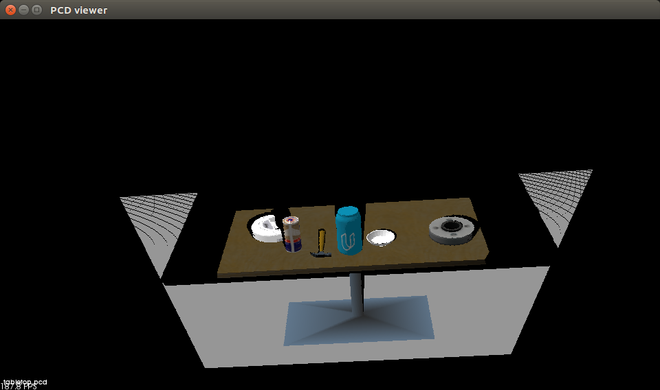
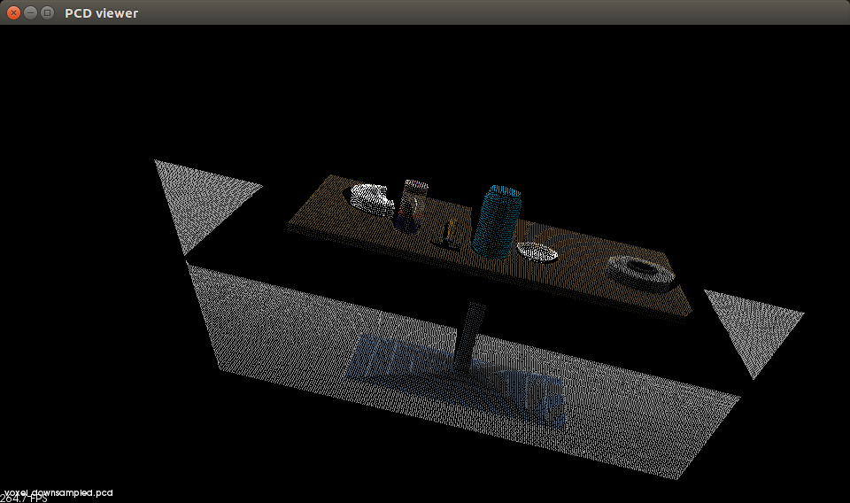
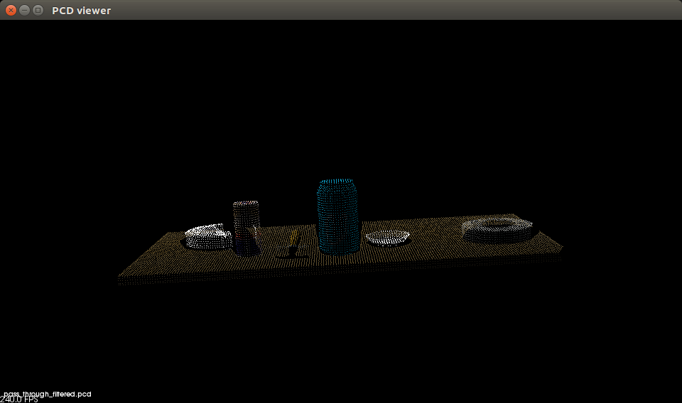
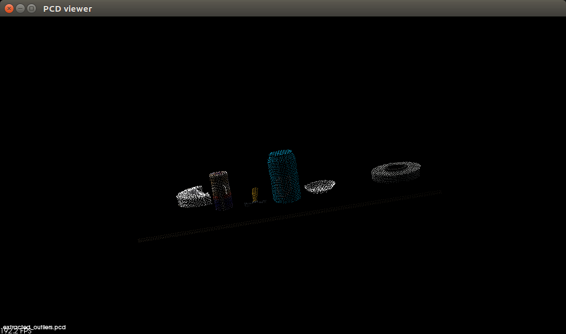
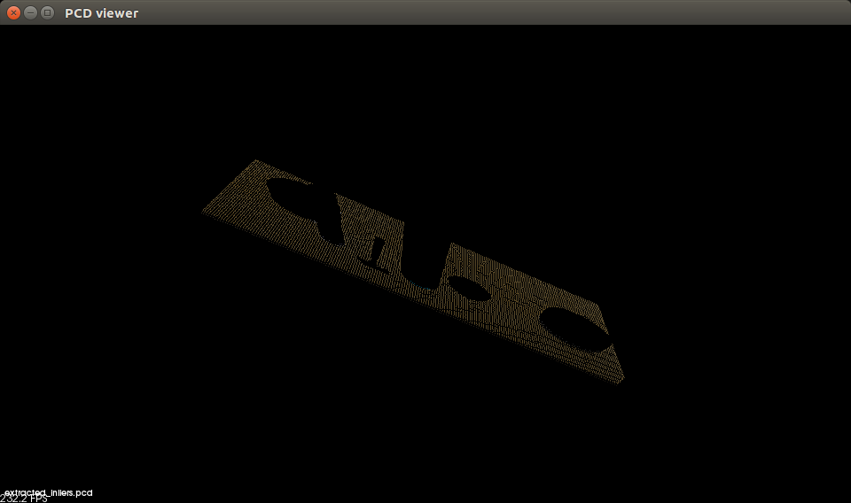
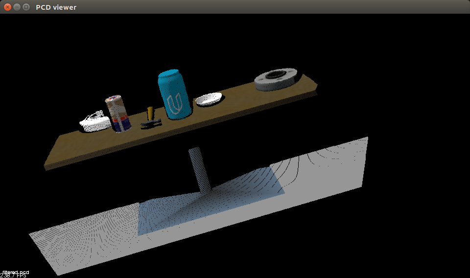
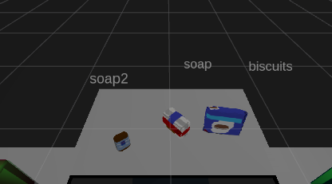
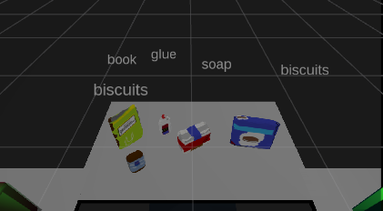
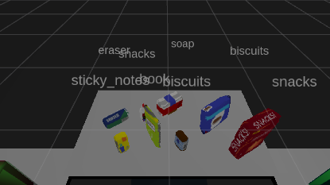

### Writeup 

#### 1. Complete Exercise 1 steps. Pipeline for filtering and RANSAC plane fitting implemented.
In this step, I was required to run each of the operation on PointCloud data I need to create the pipeline. This exercise helped me better visualise each of the steps of the Perception Pipeline. I decided to apply them all one at a time, to see how the output changes, and even tried to skip some operations to see how the next step in the pipeline is effected. Applied the Voxel operation to downsample the data, and increase efficiency for further processing, the perfect Leaf size would give the perfect trade-off between gaining speed, by decreasing computation, v/s losing out information about the pointcloud. Passthrough filter was applied to concentrate only on the region of interest, and remove the extra areas. RANSAC was applied to find the plane (table in this case), and since prior filtering was applied, all the leftover point/outliers were the objects of interest.
The inliers and outliers were seperated after this step.

Original input

After Voxel

After Passthrough

After RANSAC: Objects

After RANSAC: Tabletop

#### 2. Complete Exercise 2 steps: Pipeline including clustering for segmentation implemented.  
The Pipeline used above was added to the pcl_callback function for the Subscriber node of /sensor_stick/point_cloud, the output of the pipeline were the inliers (table) and outliers (objects on the table). But it is not known which point belongs together to form one object, to solve this clustering was used. DBSCAN clustering was chosen above K-Means method, since the number of clusters/objects isn't known. Min and Max possible cluster sizes were defined, and tolerance for which point is allowed in a cluster was added. Experimenting with these values gave different number of clusters. DBSCAN was applied and each cluster with a different color were published on /pcl_cluster topic, and the output was checked using RViz.

After Statistical Outlier Removal

#### 3. Complete Exercise 3 Steps.  Features extracted and SVM trained.  Object recognition implemented.
Once the clustering was done, it was time to identify each cluster, i.e. give them a label. For this color and surface normal histograms were taken, and SVM was used as a classifier. The classifier was trained in a seperate environment, were each object would spawn a predefined number of times in different orientations, and the RGB-D sensor would record the data and assign it the proper label. The sensor would take the color and depth info, from which color histogram and surface normal histogram was formed, and these histograms were concatenated and passed to a classifier (SVM in this case). It was found that the number of times the object spawns for training, the color space for which histogram is found, the size of the bins, greatly effected how the feature descriptor is made and made a lot of difference in classification accuracy. 200 spawns of the object, HSV color space and 32 bins for both color and surface normal histograms were found to give the best result for the SVM. The SVM was giving around 90% accuracy for all the objects, and all the clusters were then passed through the same feature extraction part and passed through the SVM to be classified. The cluster label was displayed over all the objects.

### Pick and Place Setup

#### 1. For all three tabletop setups (`test*.world`), perform object recognition, then read in respective pick list (`pick_list_*.yaml`). Next construct the messages that would comprise a valid `PickPlace` request output them to `.yaml` format.
The final project even though was fairly simple after doing the first 3 exercises, required some work. As the data was more realistic now, and the environment was different new values for all the parameters had to be adjusted. Most of the work was done and each of the clusters was labelled now, so now only the parameter server had to be read, to find which order the objects should be picked up in, which object belongs to which box, the location of the boxes and which arm corresponds to which box. To find the pick up location of the object, the cluster centeroid was found and passed to the robot. Using all these info the yaml was created for each of the 3 examples. 

World 1

World 2

World 3

To perform the challenge, a seperate node can be created to store the collision information of the table, and the current node will publish the pointcloud of all the objects which are not to be picked up, another node can listen to both these publishers and combine and send them to /pr2/3d_map/points. 

